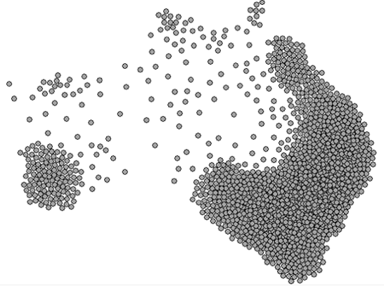
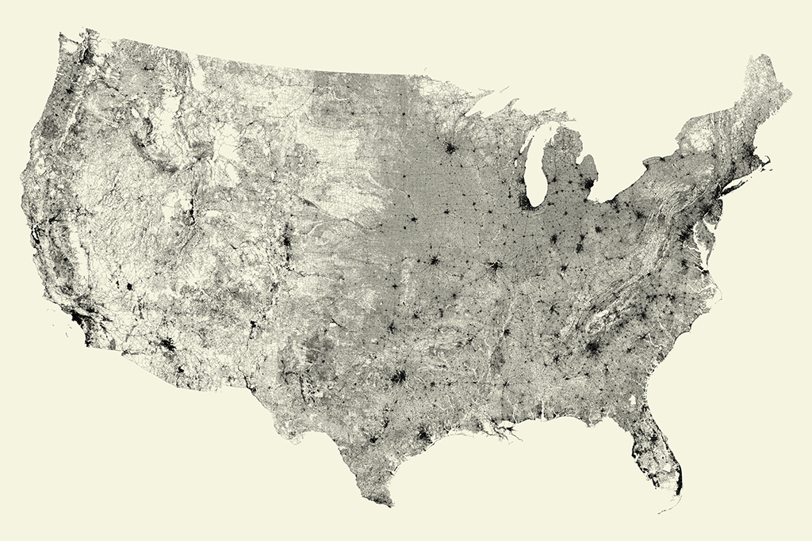
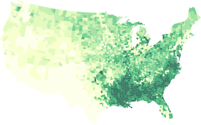
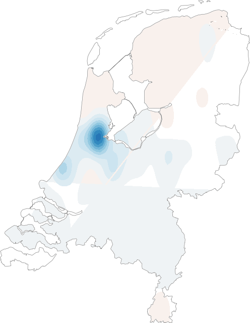
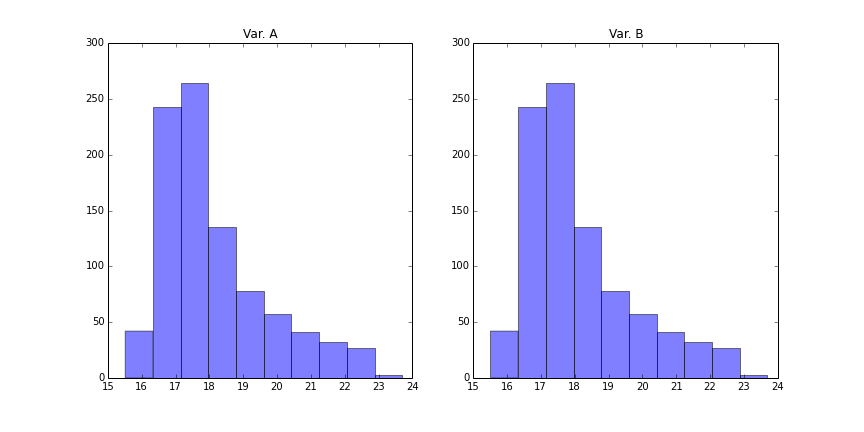
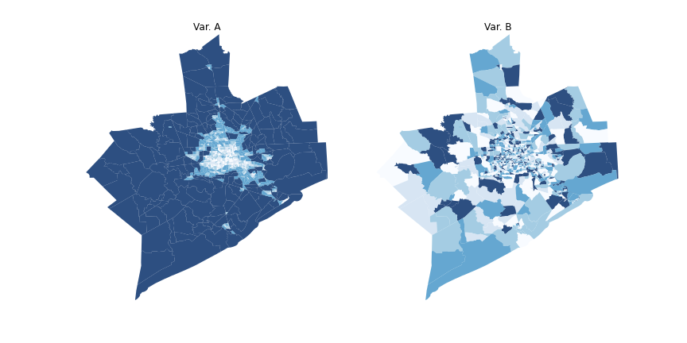

% Spatial Data, Analysis, and Regression - I
% A mini-course
%[Dani Arribas-Bel](http://darribas.org)

# Purpose

$\;$

- Overview of (some) statistical techniques that explicitly include **space**
- Focus on methods directed at Social Scientists (lattice data)
- Computer labs to demonstrate how to perform some of these analysis
  (scheduling *"roughly"* split 50-50, but accomodating content)

##
## Philosophy

- *Pointing* more than *delving* deep

    - $Today \in All$ but $All \notin Today$

-   References
-   Interactive classes $\rightarrow$ Stop, interrupt and ask me!!!

## Things we will not talk about...

... but could also be called spatial modelling:

* Point pattern analysis
* Spatial prediction (geostatistics, kriging...)
* Conditional models
* Bayesian estimation

# Outline

## First block

$\;$

Morning:

* Spatial data for social scientists
* Why spatial analysis?
* Spatial autocorrelation

After-noon:

* Spatial weights matrices
* The spatial lag operator
* Exploratory Spatial Data Analysis (ESDA)

    * Global
    * Local

## Second block

$\;$

Spatial regression

* Motivation
* Specification
* Diagnostics
* Estimation
* Software implementation

## Labs

Inserted between lecture time to be closer to the contents

* **[I]** GIS: QGIS
* **[II]** Exploratory analysis: GeoDa
* **[III]** Spatial regression: GeoDaSpace
* **[IV]** Code: PySAL

# Spatial data

* Observations that can be related to a location in (geographical) space
* Multiple formats:

##

## 1. Points (e.g. firms)

## 2. Lines (e.g. Streets)

[Ben Fry. *All Streets*] 

## 3. Polygons (e.g. regions)

## 4. Surfaces (e.g. elevation)

## Increasing relevance:

* Popularization of locational technologies (e.g. GPS)
* "Data-fication" of the world (Big Data, open data, IoT... Much of this
  has a spatial footprint)
* Increase in: computational power + storage + open source

# What's the point of *spatial*?
##
##
$\;$

##
$\;$

##

* Some processes of interest for social scientists have a strong spatial
  dimension $\rightarrow$ *where* is a legitimate question in itself and is at
  the heart of the mechanisms that explain them. For
  example:

    * Residential population distribution and (lack of) mixing
    * Employment (urban centers, regional concentration of industries...)
    * Income
    * ...

* **Non-spatial** techniques completely ignore this aspect and do not provide
  tools to gain insight about issues where location plays a role
* **Spatial analysis** provides a set of statistical tools that expand the amount
  of insight to be learnt from a given dataset, beyond what non-spatial
  methods allow for

# Spatial Autocorrelation
##

$\;$
Inter-dependence mediated through space
$\;$

* Spatial randomness
* Positive spatial autocorrelation
* Negative spatial autocorrelation

## Spatial randomness

$\;$

* Completely random allocation of values across space
* Space plays no role whatsoever
* Traditional assumption in the non-spatial world but the exception rather than the rule in practice

## Positive

* Closer values are more similar to each other than further ones
* Tobler's first law of Geography
* Present in many social science phenomena

$\;$

### Negative

* Closer values are more *dissimilar* to each other than further ones
* Harder to interpret, but associated with spatial competition
* Example: retail location

$\;$

$\rightarrow$ **Demo** lattice

# Dependence Vs. heterogeneity

$\;$

- **Dependence** $\rightarrow$ Interaction, interdependence
- **Heterogeneity** $\rightarrow$ Intrinsic characteristics unevenly
  distributed over space

-   With a cross-section, hard (impossible) to tell whether outcomes
    arise from interaction or from intrinsic individual characteristics
-   Spatial dependence Vs. Spatial heterogeneity

    * Positive spatial autocorrelation $\rightarrow$ spatial
    difussion / spillovers
    * Negative spatial autocorrelation $\rightarrow$ spatial
    competition

-   Same problem as in social networks: intrinsic individual
    characteristics or personal interaction (see
    [this](http://www.youtube.com/watch?feature=player_embedded&v=JmajkTKlEqw&noredirect=1#)
    video for a great explanation)?

#
 Spatial Data, Analysis and Regression - A mini course by <a xmlns:cc="http://creativecommons.org/ns#" href="http://darribas.org" property="cc:attributionName" rel="cc:attributionURL">Dani Arribas-Bel</a> is licensed under a <a rel="license" href="http://creativecommons.org/licenses/by-nc-sa/4.0/">Creative Commons Attribution-NonCommercial-ShareAlike 4.0 International License</a>.

